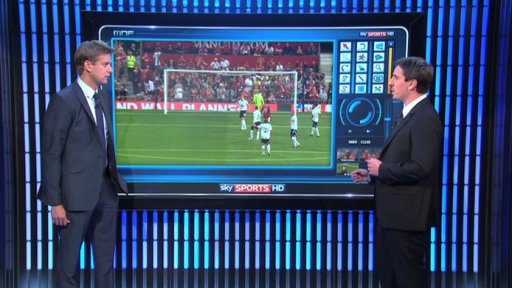
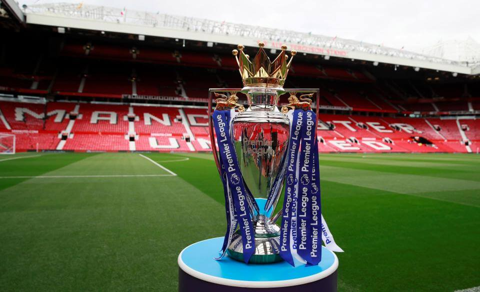

 
 

Before you view the model below, there are a few things which you should take into account.

1. Some teams are lucky that over the six seasons we are looking at, they have been present in the league whereas some teams are relegated and promoted to the league hence why some teams do not take into account all of the seasons.
 
2. The finance data received by the premier league is from broadcasting rights and we have catergorized them into 3 groups: 

- Equal Share Payments = 50 % are equally            shared between Premier League clubs

- Facility Fees = 25% shared based on how             often a club's matches are broadcasted in           the UK. The teams with more supporters are           more likely to have their games                     broadcasted. The teams who have just been           promoted are unlikely to have the global            reach such as teams like Manchester United           who have been a prominent figure in the             league.

- Merit Payments = 25% based on where a             club finish in the league table.

 

