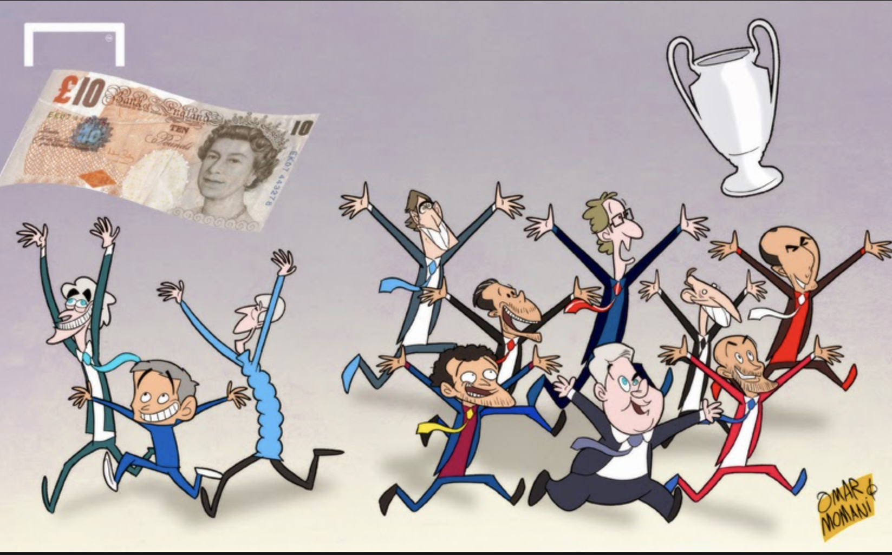

<h2> General Conclusions</h2>

 

These are a few of the major themes which have come from comparing the model above, these are not limited but included:

1. Staying in the Premier League is so important. Teams who have the odd season bad season and are still in the league are able to recover due to the cumulative income received over time. Teams who only stay in the league for one season such as Portsmouth, are heavily reliant on the money received from the last season in the Championship, they do not have the economic power to cause much change in league position such as buy the best players out there.

2. Teams lower down in the table rely more on equal share payments as they receive less merit payments and facility fees. 

3. Teams who stay in the Premier league for longer have increased facility fees over time. This is attributed to increased global exposure, more people are wanting to watch them play and hence more games are broadcasted. This is extra income for those teams.

4. As well as staying in the league, consistency in position is key. Flucuations seen in many teams lower down the table means teams cannot prepare for the upcoming seasons and if they are lucky to stay in the league, they cannot plan how to improve until season is finished. So finishing in a position which is higher or the same as before can be important.

5. Teams at the end of the model receive more money in general no matter what positon the team finishes in. This means for some teams it is even more important to stay in the league as the gap between money the league grows. 

6. There is less one season teams the further into the model you go. This causes us to question the teams and their management of their cumulative income of previous seasons. But also, teams could perform better knowing what is at risk if they get relegated 

 

The aim of my model is to find out the economic consequences of your league position so the longer you stay in the premier league, the more popular the club will become and the more games which will be broadcasted, increase in facility fees. The longer you stay in the premier league is dependent on your position. In regards to, equal share payments it can be used as a baseline to compare the other two categories. The better position you finish in the more merit payment received.

 
 

